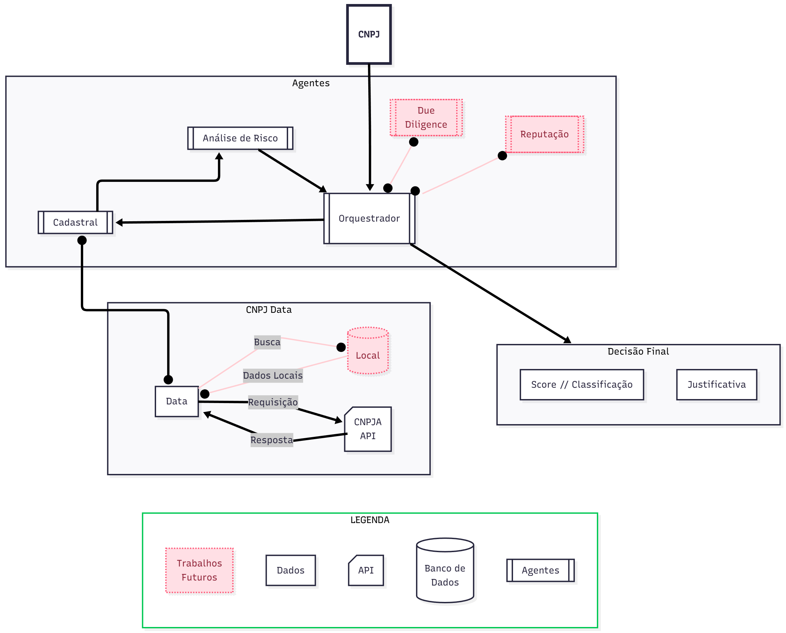

# CNPJ X-RAY

	

## Projeto de Consulta CNPJ com agentes de IA

	

Um projeto para consulta e análise de dados de empresas através da API [Open CNPJ](https://cnpja.com/api/open).
	
## 🏷️ Índice

- [Visão Geral da Solução](#🎯-visão-geral-da-solução)
- [Arquitetura de Agentes](#⚡-arquitetura-de-agentes)
- [Estratégia de Análise](#🛠-estratégia-de-análise)
- [Stack Tecnológico](#⚙️-stack-tecnológico)
- [Estratégia de Implementação](#📋-estratégia-de-implementação)
- [Instalação e Setup](#🚀-instalação-e-setup)
- [Como Executar](#💻-como-executar)


## 🎯 Visão Geral da Solução

	

Proponho um sistema de multiagentes de IA chamado "CNPJ X-Ray". A solução recebe um CNPJ e orquestra os agentes internos para coletar e analisar os dados públicos que temos sobre ess CNPJ e por fim criar um relatório final com o resultado se a empresa se enquadra no que é buscado.

	

Isso reduzirá o tempo de análise para segundos e garantirá decisões consistentes.

	



	

## ⚡ Arquitetura de Agentes

	

A arquitetura proposta é composta de alguns agentes especializados, cada um com sua respectiva função única com a coordenação de um Agente "Orquestrador".

	

- <b>Agente Orquestrador</b>: É como um "Gerente". Recebe o CNPJ, distribui as tarefas, coleta os resultados e monta o relatório final. <u>Justificativa</u>: Centraliza todo o fluxo e garante uma padronização das respostas, além de que facilita a escalabilidaded do projeto com, por exemplo, adição de novos agentes.

	

- <b>Agente Cadastral</b>: É o responsável por coletar os dados mais brutos. No escopo atual é responsável pela requisição da API pública <a  href="https://cnpja.com/api/open"> Open CNPJ </a>. <u>Justificativa</u>: Isola a lógica de acesso aos dados. Se a API for subtituída ou for mais completa (ex.: adição de cache), apenas o agente isolado é modificado. Em trabalhos futuros também será capaz de fazer verificações em dados locais.

	

- <b>Agente de Análise de Risco</b>: É o especialista do projeto. Nesse caso suas diretivas serão direcionadas para a lógica fechada do negócio para gerar as análises. Recebe os dados brutos do <u>Agente Cadastral</u> para tomar as decisões. <u>Justificativa</u>: Facilita o ajuste das métricas. Como possui um padrão de negócio fechado, será responsável pela análise das métricas (vide [Estratégia de Análise](#estratégia-de-análise)).
	

## 🛠 Estratégia de Análise

	

No estado atual, sigo algumas regras para a análise sobre os dados públicos.

### Análise dos Dados

<b>Das métricas</b>:

- <u><b>Status</b></u>: A situação cadastral do CNPJ é o registro da empresa junto à Receita Federal e pode variar entre os seguintes status:

	- <u>Ativa</u>: Indica que a empresa está regular (obrigações fiscais e cadastrais).

	- <u>Suspensa</u>: Situação temporária. Ocorre por pendências legais, inconsistência de dados ou suspeita de fraude.

	- <u>Inapta</u>: Ocorre quando a empresa deixa de apresentar declarações contábeis e demonstrativos por dois anos consecutivos.

	- <u>Baixada</u>: Significa que o CNPJ foi encerrado. Baixa voluntária ou decisão administrativa da Receita Federal.

	- <u>Nula</u>: Significa que o CNPJ foi anulado. Geralmente por fraudes, dados incorretos ou duplicidade de inscrições.

- <u><b>Capital Social</b></u>: É o valor que os sócios investem na empresa para cobrir os custos iniciais de abertura e funcionamento, até que o negócio se torne lucrativo

- <u><b>Tempo de abertura</b></u>: Aqui é a diferença entre a data atual e a data em que a empresa foi oficialmente registrada na Receita Federal.

- <u><b>CNAE</b></u>: Classificação Nacional de Atividades Econômicas

	- <u>Principal</u>: Significa a principal atividade econômica de maior frequência e relevância.

	- <u>Secundário(s)</u>: Significa as atividades secundárias a empresa exerce e que geram uma receita menor. Permite que a empresa opere legalmente em frentes diferentes.

	

| Risco e Classificação <br/>(Critério / penalização de Score) | Reprovado (-10) | Alerta (-2) | Aprovado (+1) |
|:---------|:------:|:--------:|:--------:|
| Status| Inapta, Baixada, Suspensa, Nula| - | Ativa |
| Capital Social| < R$ 50.000 | < R$ 100.000 | >= R$ 100.000 |
| Tempo de Abertura| < 1 ano | < 2 anos | >= 2 anos |
| CNAE (Educacional)| Sem nenhuma relação | Apenas no CNAE Secundário | Presente no CNAE Principal |

### Classificação Final

- <u><b>Reprovado</b></u>: Score < 0

- <u><b>Atenção</b></u>: 0 >= Score <= 2

- <u><b>Aprovado</b></u>: Score > 2

	
	


### Exemplo de saída
```json
{
	"cnpj": "XX.XXX.XXX/0001-XX",
	"razao_social": "NOME DA IES...",
	"classificacao": "Atenção",
	"score": 1,
	"justificativas": [
		"Capital Social abaixo do ideal (R$ 80.000)",
		"Empresa com menos de 2 anos de operação"
	]
}

```
	

## ⚙️ Stack Tecnológico

	

- <u>Linguagem</u>: Python 3+

	

- <u>Framework de Agentes</u>: Arquitetura própria baseada em <b>Programação Orientada a Objetos (POO)</b>, separando responsabilidades em classes de Agentes (Orchestrator_agent, Cadastral_agent, Risk_analysis_agent).

- <u>Interface Gráfica</u>: <b>Eel</b> (para criar a ponte entre Python e a interface web HTML/CSS).

	

- <u>Comunicação API</u>:<b> httpx</b> (para chamadas assíncronas e robustez)

	

- <u>Validação de Dados</u>: <b>Pydantic</b> (para garantir a estrutura dos dados da API e da saída)

	

- <u>Gerenciamento de Dependências</u>: <b>pip requirements.txt</b>

	

- <u>Uso de LLMs</u>: Não utilizado neste MVP para garantir determinismo e custo monetário zero. Isso fica para a parte de aplicações futuras. A arquitetura está pronta para a inclusão futura de LLMs no <u>Agente de Análise de Risco</u> para tarefas mais complexas (como análise de reputação).

	
	

## 📋 Estratégia de Implementação

	

O protótipo atual é um script Python funcional que implementa os requisitos mínimos:

	

- <b>Recebe um CNPJ como input</b>.

	

- <b>Consome a API open.cnpja.com</b>.

	

- <b>Executa a lógica com aqueles 4 critérios de análise (Status, Capital, Tempo, CNAE)</b>.

	

- <b>Retorna um output estruturado com a classificação e justificativas</b>.

	

- <b>Possui tratamento de erros (CNPJ inválido, API offline, etc.)</b>.

	

- <b><u>(Diferencial)</b></u> Fornece uma <u>Interface Gráfica (UI)</u> simples e funcional para uso não-técnico.

	

### Roadmap de Evolução

- API REST: Evoluir o `app.py` de Eel para uma API REST completa (FastAPI) o que pode ser usado de forma mais completa e ser utilizadoo em serviços internos.

- Agentes: Implementar formalmente a arquitetura de agentes (ex: CrewAI).

- Agente de Due Diligence (Setor Jurídico): É mais complexo, terá a função de análise de fontes externas como: tribunais de justiça e diários oficiais para identificar processos judiciais, pendências ou restrições legais.

- Agente de Reputação: A ideia é que esse agente busque na internet (via API de busca) em notícias e menções dos IES, para uma análise de sentimento para tentar analisar riscos reputacionais que são mais "sociais" e estão fora da "visão jurídica".

- LM: Adicionar um LLM ao Agente de Análise para interpretar campos de texto, o que ajuda a identificar riscos que podem ser mais sutis.

- <b>LangChain para Agentes Avançados</b>: Implementar o LangChain para criar agentes mais sofisticados com ferramentas especializadas, memory e melhor orquestração de tarefas complexas.
	
	

## 🚀 Instalação e Setup

	

Este projeto utiliza Python 3.10+ e gerencia suas dependências de forma simples.

	

<b>Pré-requisitos:</b>

* <b>Python 3.10</b> (ou superior) instalado.

* <b>`pip`</b> (gerenciador de pacotes do Python).

	

### Passos para Instalação

	

1. <b>Clone o Repositório:</b>

```bash

git clone https://github.com/vini-mon/CNPJ-X_Ray.git

cd CNPJ-X_Ray

```

	

2. <b>Instale as Dependências:</b>

Todas as bibliotecas necessárias estão listadas no arquivo `requirements.txt`.

```bash

pip install -r requirements.txt

```

	
	
	

## 💻 Como Executar

	

O protótipo é executado através do script `main.py`, que aceita um ou mais CNPJs como argumentos de linha de comando.

	

### Modo 1 - Linha de Comando (CLI)

	

Este modo é ideal para testes rápidos, scripts ou integração com outros processos de back-end.

O script `main.py` funciona como uma ferramenta CLI (Command-Line Interface).

	

```bash

python main.py  <CNPJ_1> [CNPJ_2] [CNPJ_3] ...

```

### Modo 2 - Interface Gráfica (recomendado)

	

Este modo inicia uma aplicação visual onde você pode colar uma lista de CNPJs e ver os resultados em tempo real.

	

1. Execute o scrpit `app.py`

```bash

python app.py

```

	

2. Uma janela da aplicação será aberta no seu navegador

3. Cole os CNPJs (um por linha) na área de texto e clique em "Analisar CNPJs"

	

